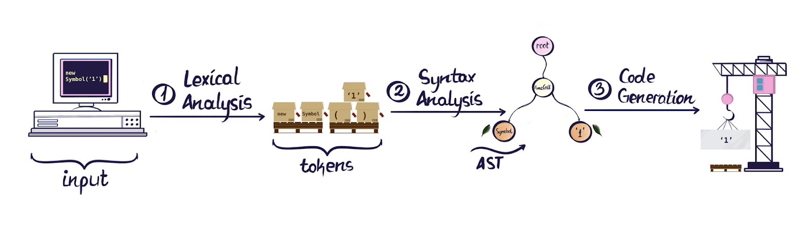
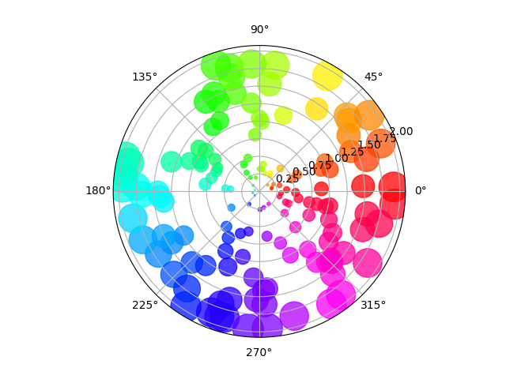

<style>
@import url(https://fonts.googleapis.com/css?family=Google+Sans);
:root {
    font-family: "Google Sans";
    --color-background: #ddd;
    --color-background-code: #ccc;
    --color-background-paginate: rgba(
        128, 128, 128, 0.05
    );
    --color-foreground: #345;
    --color-highlight: #99c;
    --color-highlight-hover: #aaf;
    --color-highlight-heading: #99c;
    --color-header: #bbb;
    --color-header-shadow: transparent;
    img[alt~="center"] {
        display: block;
        margin: 0 auto;
    }
}
section::after {
content: attr(data-marpit-pagination) '/' attr(data-marpit-pagination-total);
}
</style>
# Producción Académica con Pandoc
UTN-BA Escuela de Posgrado
### Maestría en Ingeniería en Sistemas de Información
Dra. Ma. Florencia Pollo Cattaneo
### Herramientas para el desarrollo de Tesis
Trabajo Práctico Final
Lisandro Fernández

Octubre 2022. Buenos Aires, Argentina.


---
# Article Boilerplate

Entorno de producción de literatura académica y documentación técnica con _Pandoc_ como interprete y _LaTeX_ como sistema de composición tipográfica. Generación gráficos, diagramas y notación matemática; gestión de citas, referencias cruzadas y bibliografía. Evitando el uso de interfaces gráficas y captivas.

Keywords: _authoring, plain text, CLI, pandoc_.

---

# Contenidos
1. **Introducción:** Pandoc, TUI, Markdown.
2. **Integración:** Árbol de sintaxis abstracta. Gráficos y diagramas. Citas, referencias y bibliografía. Notación matemática.
3. **Resultados:** Pandoc's Markdown. Biblografia y referencias cruzadas.
4. **Conclusión:** Futuras lineas de trabajo: Entrega Continua. SMS.
5. **Agradecimientos.**
6. **Referencias.**

---
# 1. Introducción
* Pandoc
* Interfaz Textual de Usuario ≠ Interfaces Captivas
* Markdown

---
## Pandoc
<style scoped>
p { columns: 2; }
</style>


<br>..Biblioteca de Haskell (y CLI tool) para convertir de un formato de marcado ligero a otro.
<br>Fuente de la imgen: [Formatting Open Science: agilely creating multiple document formats for academic manuscripts with Pandoc Scholar
](https://peerj.com/articles/cs-112/)

---
## Interfaz Textual de Usuario ≠ Interfaces Captivas
>...our base material isn't wood or iron, it's knowledge. [...]. And we believe that the best format for storing knowledge persistently is plain text. With plain text, we give ourselves the ability to manipulate knowledge, both manually and programmatically, using virtually every tool at our disposal.
*(Hunt, 1999)*

---
<style scoped>
li { font-size:28px; }
</style>
- **Ubicuo:** Todos los sistema operativo cuenta con al menos un editor de texto plano. 
- **Fácil de manipular, mantener y comprobar:** Procesos rudimentarios. No presenta dificultades ante la necesidad de actualización. Es sencillo agregar rutinas de testeo sin emplear o desarrollar herramientas especiales .
- **Liviano:** Determinante cuando los recursos de sistema son limitados.
- **Seguro contra la obsolescencia:** Perduran por sobre otros formatos, aun cuando caduquen las aplicaciones que las hayan creado.
- **Accesibilidad:** Beneficia a todos los usuarios, incluidas las personas con discapacidades cognitivas, con poca capacidad de lectura y las que se enfrentan a un tema o un idioma desconocido; estos deben ser capaces de encontrar lo que necesitan, entender lo que encuentran y utilizarlo para realizar tareas.

---
## Markdow
```
# Dillinger
## _The Last Markdown Editor, Ever_

[](https://nodesource.com/products/nsolid)

[](https://travis-ci.org/joemccann/dillinger)

Dillinger is a cloud-enabled, mobile-ready, offline-storage compatible,
AngularJS-powered HTML5 Markdown editor.

- Type some Markdown on the left
- See HTML in the right
- ✨ Magic ✨
```

---
# 2. Integración

* Árbol de sintaxis abstracta.
* Gráficos y diagramas. Citas, referencias y bibliografía
* Notación matemática.

---
## Árbol de sintaxis abstracta

Fuente: [twilio.com/blog/abstract-syntax-trees](https://www.twilio.com/blog/abstract-syntax-trees)

---
## Gráficos y diagramas

```
import numpy as np
import matplotlib.pyplot as plt
np.random.seed(23)
N = 150
r = 2 * np.random.rand(N)
theta = 2 * np.pi * np.random.rand(N)
area = 200 * r**2
colors = theta 
fig = plt.figure(dpi=1200) 
ax = fig.add_subplot(111, projection='polar')
c = ax.scatter(
    heta, r, c=colors, s=area, cmap='hsv', alpha=0.75
)
plt.title('This is an example figure')
```
---



---
## Citas, referencias cruzadas y bibliografía
BibLaTeX una reimplementación completa de las facilidades bibliográficas proporcionadas por LaTeX. 
Esto significa, por ejemplo que al declarar una referencia como `@moolenaar2000` o también `[@knuth1986texbook p.3-9]` _Pandoc_ las convertirá en una cita con el formato predefinido, utilizando cualquiera de los cientos de Lenguajes de Estilo de Cita (Citation Style Language - CSL), incluyendo estilos de nota al pie, numéricos y autoría, fuente y fechas; y añadirá a la referencia bibliografía con el formato adecuado al final del documento.

---
## Notación matemática
```
Cuando $a \ne 0$, hay dos soluciones $(ax^2 + bx + c = 0)$ las cuales son $x
= {-b \pm \sqrt{b^2-4ac} \over 2a}.$
```

Cuando $a \ne 0$, hay dos soluciones $(ax^2 + bx + c = 0)$ las cuales son $x
= {-b \pm \sqrt{b^2-4ac} \over 2a}.$

---
# 3. Resultados

## Veamos la fuente

[**Entrada en MarkDown**](https://raw.githubusercontent.com/lifofernandez/article-boilerplate/main/README.md)


## Veamos el documento

[**Salida en Portable Document Format (PDF)**](https://github.com/lifofernandez/article-boilerplate/blob/main/README.pdf)


---
# 4. Conclusión

* Aporte
* Futuras lineas de trabajo 
    * Entrega Continua
    * SMS

---
## Aporte

Una cadena de producción de documentos científicos y técnicos sin depender de interfaces gráficas o captivas.

Las características generales de este entorno son:
* formatos libres y abiertos, componentes aislados, compactos y robustos.
* amplia compatibilidad con requisitos de estilo, predefinidos por la comunidad o personalizados por el usuario.
* Vinculación a fuentes de datos remotas para publicaciones recurrentes con información dinámica.

---
## Futuras lineas de trabajo
* Entrega Continua
* Revisión sistemática de literatura

---
### Entrega Continua

La salida puede ser producido  mediante operaciones remotas automáticas.

[](https://github.com/lifofernandez/thesis-sandbox/actions/workflows/main.yml)

Los servicios de entrega continua compilan los cambios incrementales en el contenido de los autores, los enlazan, los empaquetan y los ejecutan en un entorno remoto preconfigurado.Servicios como estos acortan las brecha entre las actividades y los equipos de producción, al imponer la automatización en la construcción y entrega de documentos. 

---
### Revisión sistemática de literatura

Este proceder promueve capacidades como ordenación personalizable, bibliografías jerarquizadas por sección, soporte de poliglosia para el cambio automático de idioma de las entradas y citas bibliográficas; modelo de datos personalizable para que los usuarios puedan definir sus propios tipos de datos bibliográficos y validarlos con respecto a un modelo.

En revisiones de literatura del tipo estudio de mapeo sistemático, donde se involucran múltiples cuerpos bibliográficos con diferente ordenación y exposición, enfoques como el desarrollado simplifican el trabajo y asisten en el proceso.

---
<style scoped>
p { columns: 2; }
</style>
# Gracias
**¿Preguntas?**<br>
**¡Pull Requests bienvenidos!** [github.com/lifofernandez/article-boilerplate](https://github.com/lifofernandez/article-boilerplate)
<br>


---
<style scoped>
li { font-size:14px; }
</style>
# 5. Referencias
- W. Caleb McDaniel, «Why (and how) I wrote my academic book in plain text», W. Caleb McDaniel. Disponible en: http://wcaleb.org/blog/myacademic-book-in-plain-text
- J. MacFarlane, «Pandoc - a universal document converter», Pandoc - a universal document converter. 2022. Accedido: 14 de septiembre de 2022.
.En línea. Disponible en: https://pandoc.org/
- D. E. Knuth, D. Knuth, y D. Bibby, The TeXbook. Addison-Wesley, 1986.  Disponible en: www-cs-faculty.stanford.edu/~knuth/abcde.html
- M. Gancarz, Linux and the Unix Philosophy. Elsevier Science, 2003.  Disponible en: https://books.google.com.ar/books?id=qqstCSlk5MIC
- A. Hunt y D. Thomas, The Pragmatic Programmer: From Journeyman to Master. Pearson Education, 1999. Disponible en: https://books.google
.com.ar/books?id=5wBQEp6ruIAC
- D. A. S. U. Harvard, «Use plain language», Digital Accessibility. Digital Accessibility Services. Disponible en: https://accessibility.huit.harvard.edu/use-plain-language
- B. Moolenaar, «Seven habits of effective text editing». moolenaar.net, 2000. Disponible en: moolenaar.net/habits.html
- B. Baumer y D. Udwin, «R Markdown», Wiley Interdisciplinary Reviews: Computational Statistics, vol. 7. Wiley, pp. 167-177, febrero de 2015. doi:
10.1002/wics.1348.
- R. Scape, «Text Is the Universal Interface». 2022. Disponible en: https: //scale.com/blog/text-universal-interface
- 10 S. Marlow et al., «Haskell 2010 language report». 2010. Disponible en: http://www.haskell.org
- J. Jones, «Abstract Syntax Tree Implementation Idioms», Pattern Languages of Program Design, 2003, Disponible en: http://hillside.net/plop/plop2003/Papers/Jones-ImplementingASTs.pdf
- I. Neamtiu y I. Bind, «Understanding source code evolution using abstract syntax tree matching», 2005, pp. 2-6.
- J. Gruber, «Markdown: Syntax», Daring Fireball: Markdown Syntax Documentation. Disponible en: https://daringfireball.net/projects/markdown/syntax#philosophy
- L. R. de Cotret, «Pandoc Plot». 2019. Disponible en: https://laurentrdc .github.io/pandoc-plot
- D. F. Hunter John; Dale y T. M. development team, «Matplotlib: Visualization with Python». 2013. Disponible en: https://matplotlib.org/
- A. Roques, «PlantUML Generate UML diagram from textual description».  2013. Disponible en: https://plantuml.com/
